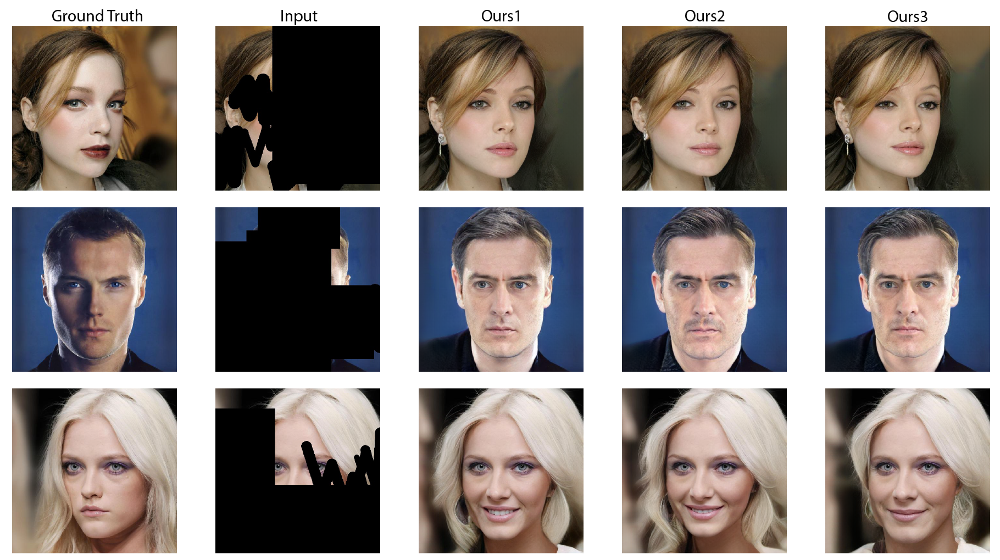
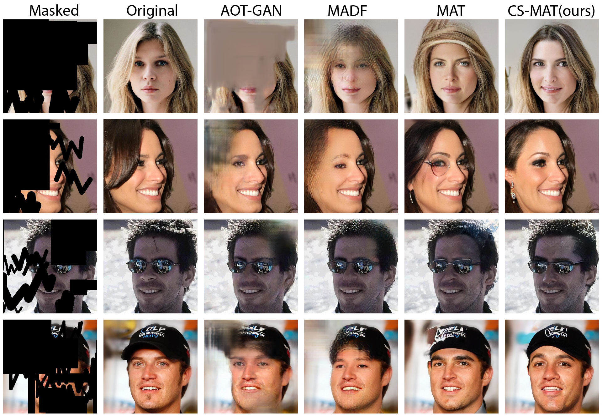
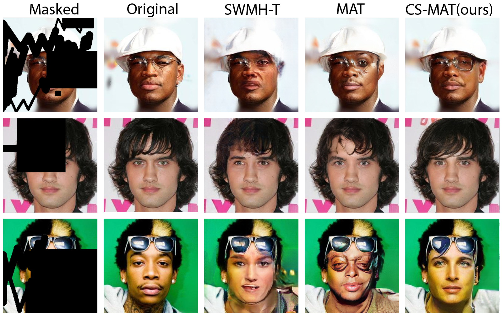

# CS-MAT: Cross-Shaped Window Mask-Aware Transformer for Large Mask Image Inpainting (2024 17th International Conference on Machine Vision - ICMV 2024)

#### Tan-Phat Nguyen, Ngoc-Tuong Le, and Ngoc-Thao Nguyen

#### [\[Paper\]]()


## App Demo

You can run the app demo at this [repo](https://github.com/ntp-shin/Inpainting).

---

## Visualization

We present a transformer-based model (CS-MAT) for large hole inpainting with high fidelity and diversity.







Compared to other methods, the proposed CS-MAT restores more photo-realistic images with fewer artifacts.

---

## Usage

It is highly recommanded to adopt Conda/MiniConda to manage the environment to avoid some compilation errors.

1. Clone the repository.
    ```shell
    git clone https://github.com/ntp-shin/CS-MAT.git
    ```
2. Install the dependencies.
    - Python 3.8
    - PyTorch 1.8.0
    - Cuda 11.1
    - Other packages
    ```shell
    pip install -r requirements.txt
    ```

## Quick Test

1. We provide models trained on CelebA-HQ at 512x512 and 256x256 resolution. Download models from [Google Drive](https://drive.google.com/drive/folders/16DTXRpgRlI0PIavRJSVyQCyTQGheWrm0?usp=drive_link).

2. Obtain inpainted results by running
    ```shell
    python generate_image.py --network model_path --dpath data_path --outdir out_path [--mpath mask_path]
    ```
    where the mask path is optional. If not assigned, random 512x512 masks will be generated. Note that 0 and 1 values in a mask refer to masked and remained pixels.

    For example, run
    ```shell
    python generate_image.py --network pretrained/CelebA-HQ.pkl --dpath test_sets/CelebA-HQ/images --mpath test_sets/CelebA-HQ/masks --outdir samples
    ```

    Note. 
    - Our implementation only supports generating an image whose size is a multiple of 512. You need to pad or resize the image to make its size a multiple of 512. Please pad the mask with 0 values.
    - If you want to use the CelebA-HQ-256 model, please specify the parameter 'resolution' as 256 in generate\_image.py.

## Train

For example, if you want to train a model on CelebA-HQ 512, run a bash script with
```shell
python train.py \
    --outdir=output_path \
    --gpus=2 \
    --batch=8 \
    --metrics=fid2993_full \
    --data=training_data_path \
    --edge=training_edge_path \
    --data_val=val_data_path \
    --edge_val=val_edge_path \
    --dataloader=datasets.dataset_512.ImageFolderMaskDataset \
    --mirror=True \
    --cond=False \
    --cfg=celeba512 \
    --aug=noaug \
    --generator=networks.csmat.Generator \
    --discriminator=networks.csmat.Discriminator \
    --loss=losses.loss.TwoStageLoss \
    --pr=0.1 \
    --pl=False \
    --truncation=0.5 \
    --style_mix=0.5 \
    --ema=10 \
    --lr=0.001
```

Description of arguments:
- outdir: output path for saving logs and models
- gpus: number of used gpus
- batch: number of images in all gpus
- metrics: find more metrics in 'metrics/metric\_main.py'
- data: training data
- edge: training edge data
- data\_val: validation data
- edge\_val: validation edge data
- dataloader: you can define your own dataloader
- mirror: use flip augmentation or not 
- cond: use class info, default: false
- cfg: configuration, find more details in 'train.py'
- aug: use augmentation of style-gan-ada or not, default: false
- generator: you can define your own generator
- discriminator: you can define your own discriminator
- loss: you can define your own loss
- pr: ratio of perceptual loss
- pl: use path length regularization or not, default: false
- truncation: truncation ratio proposed in stylegan
- style\_mix: style mixing ratio proposed in stylegan
- ema: exponoential moving averate, ~K samples
- lr: learning rate

## Evaluation

We provide evaluation scrtips for FID/U-IDS/P-IDS/LPIPS/PSNR/SSIM/L1 metrics in the 'evaluation' directory. Only need to give paths of your results and GTs.

We also provide our masks for CelebA-HQ-test [here](https://drive.google.com/drive/folders/16zztPEyOUCMOSVcyq4oCOpPeKD67gDRb?usp=drive_link).


## Citation

## License and Acknowledgement

The code and models in this repo are for research purposes only. Our code is bulit upon [MAT](https://github.com/fenglinglwb/MAT).
